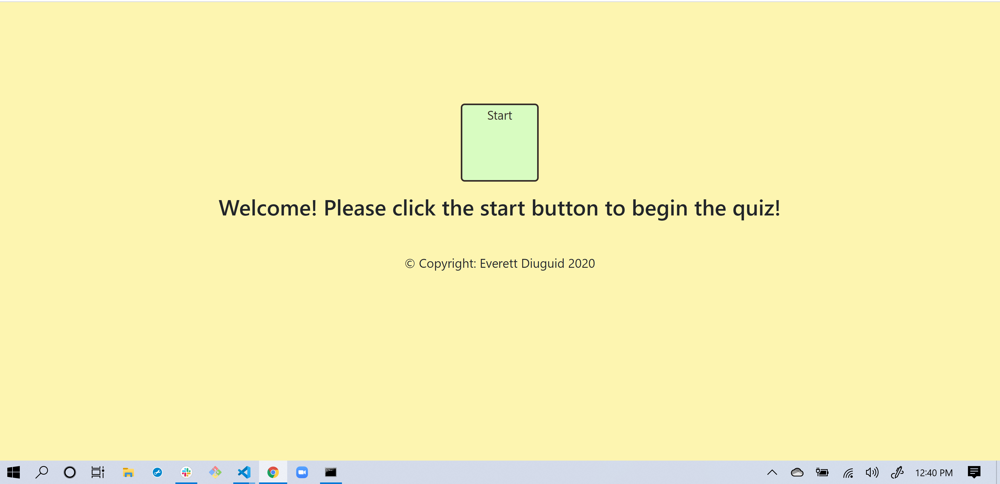

# code_quiz
Click the start button to begin, the user will have 75 seconds to answer the 4 questions, if they get an answer wrong, time will be deducted from the clock, if they get an answer right, 500 points will be awarded. After completing the questions or after time has run out, the user will be presented with their score and given the option to submit a high score or restart the quiz. The highscore is then stored and printed to a high score page. User can then restart the quiz.

This website was built using HTML, bootstrap, Javascript, and CSS with an emphasis on Javascript.  We have learned HTML provides the basic framework and structure of the page, css provides the style, and java allows the user to interact.  I struggled at first with the syntax of java and understanding that I could create CSS and HTML using Java.  It is difficult at points to do this because you want to revert back to just building the HTML ahead of time and sort of peppering in Java.  In this assignment I became more confident in my abilities to use java to create active html pages that a user can interact while limiting the amount of html in the original html file.

built by Everett Diuguid, submitted 6-11-2020.

